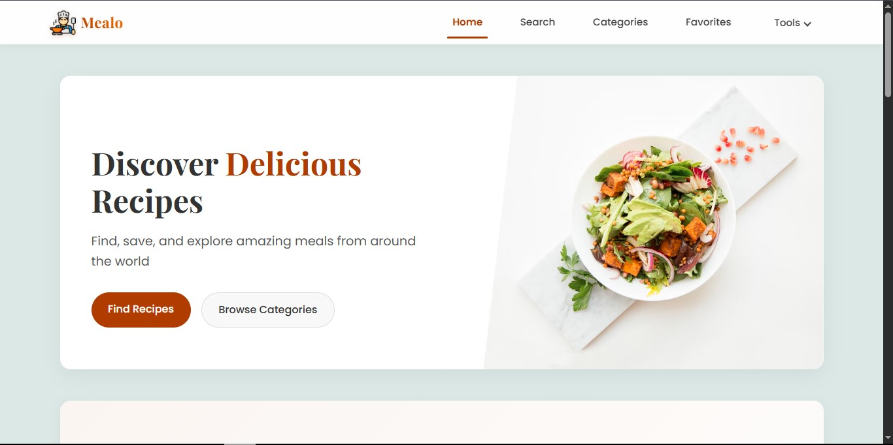

# MEALO - Your Personal Recipe Platform

MEALO is a modern, feature-rich recipe platform that helps users discover, save, and create delicious meals from around the world. Combining traditional recipes with cutting-edge AI technology, MEALO makes cooking accessible and enjoyable for everyone.



## Features

- **Recipe Search & Discovery**: Browse thousands of recipes filtered by cuisine, ingredients, or dietary preferences
- **AI Recipe Generator**: Create custom recipes based on ingredients you already have
- **Meal Planner**: Plan your weekly meals with ease
- **Nutrition Analysis**: Get detailed nutritional information for any recipe
- **Favorites**: Save your favorite recipes to access them quickly
- **Responsive Design**: Enjoy a seamless experience on desktop, tablet, and mobile devices

## Getting Started

### Prerequisites

- Node.js (v14.0.0 or higher)
- npm or yarn

### Installation

1. Clone the repository:
   ```
   git clone https://github.com/Omm-codes/mealo.git
   cd mealo
   ```

2. Install dependencies:
   ```
   npm install
   # or
   yarn install
   ```

3. Create a `.env` file in the root directory with the following variables:
   ```
   REACT_APP_MEALDB_API_KEY=1
   REACT_APP_SPOONACULAR_API_KEY=your_spoonacular_api_key
   REACT_APP_SPOONACULAR_BASE_URL=https://api.spoonacular.com
   REACT_APP_MEAL_DB_BASE_URL=https://www.themealdb.com/api/json/v1
   REACT_APP_GROQ_API_KEY=your_groq_api_key_if_using
   ```

4. Start the development server:
   ```
   npm start
   # or
   yarn start
   ```

5. Open [http://localhost:3000](http://localhost:3000) to view the app in your browser.

## Key Features & Usage

### Recipe Search

Find recipes by name, ingredients, cuisine type, or dietary restrictions. The search functionality provides filters to narrow down results based on your preferences.

### AI Recipe Generator

Upload a list of ingredients you have on hand, and our AI will create custom recipes tailored to your available ingredients and preferences.

### Meal Planning

Create weekly meal plans, generate shopping lists, and organize your cooking schedule efficiently.

### Nutrition Analysis

View detailed nutritional information for any recipe, including calories, macronutrients, vitamins, and minerals.

### Favorites System

Save your favorite recipes for quick access later. The favorites are stored locally on your device.

## Technologies Used

- **React**: Frontend library for building user interfaces
- **React Router**: For navigation and routing
- **CSS3**: For styling components
- **TheMealDB API**: For recipe data
- **Spoonacular API**: For advanced recipe search and nutrition information
- **GROQ API**: For AI-powered recipe generation

## Project Structure

```
mealo/
  public/
    index.html
    favicon.ico
    ...
  src/
    components/
      Header.js
      Footer.js
      RecipeCard.js
      SearchBar.js
      MealPlanner.js
      ...
    pages/
      Home.js
      RecipeDetails.js
      Favorites.js
      MealPlannerPage.js
      ...
    App.js
    index.js
    ...
  .env
  package.json
  README.md
```

## Contributing

We welcome contributions to MEALO! To contribute, please follow these steps:

1. Fork the repository.
2. Create a new branch (`git checkout -b feature/YourFeature`).
3. Make your changes and commit them (`git commit -m 'Add some feature'`).
4. Push to the branch (`git push origin feature/YourFeature`).
5. Open a pull request.

Please ensure your code follows the project's coding standards and includes appropriate tests.

## License

This project is licensed under the MIT License - see the [LICENSE](LICENSE) file for details.

## Contact

For inquiries or support, please contact:

- Email: [omsanjay975@gmail.com](mailto:omsanjay975@gmail.com)
- GitHub: [Omm-codes](https://github.com/Omm-codes)

---

Thank you for choosing MEALO as your personal recipe platform. Happy cooking!
